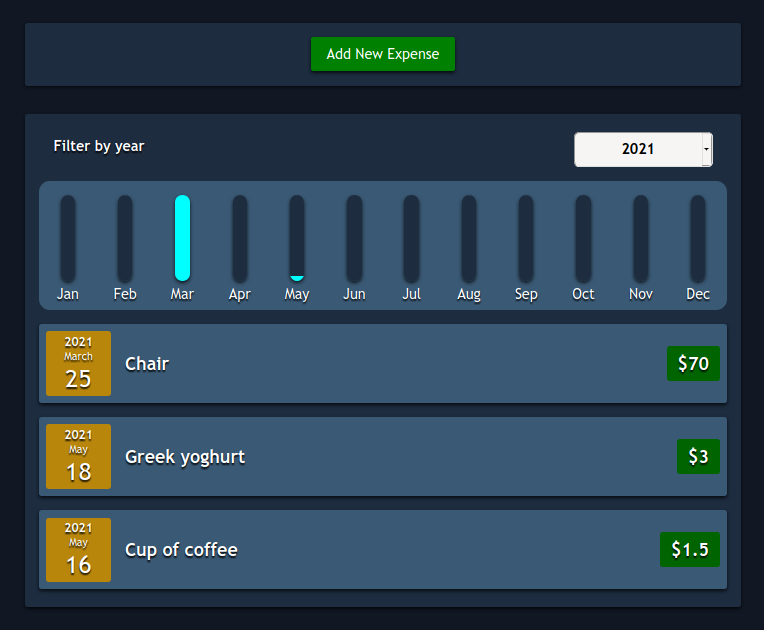

# Expenses App
An expenses-tracking web application for home use, made with the [React](https://reactjs.org/) Javascript library.

## Overview

The purpose of this project is to create a modern web application and at the same to practice what I learn about React.

DEMO [HERE](https://musing-mestorf-2a0913.netlify.app/)

**What it does:**

- [x] Save and show expenses.
- [x] Filter expenses by year *(from 2019 up to actual one)*.
- [x] Display statistics by month.

**TODO:**
- [ ] Add [IndexedDB](https://developer.mozilla.org/en-US/docs/Web/API/IndexedDB_API) support:
  - [x] Save items in store
  - [ ] Edit saved items
  - [ ] Remove items
- [ ] Implement user accounts
- [ ] Change UI design to improve usability:
  - [ ] Add themes, spinners, and user interaction feedback.
  - [ ] Row sorting
  - [ ] Add accessibility
